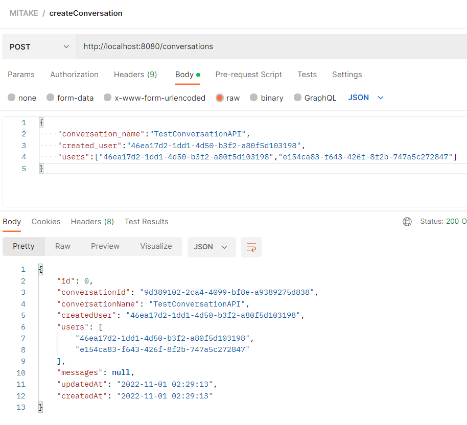
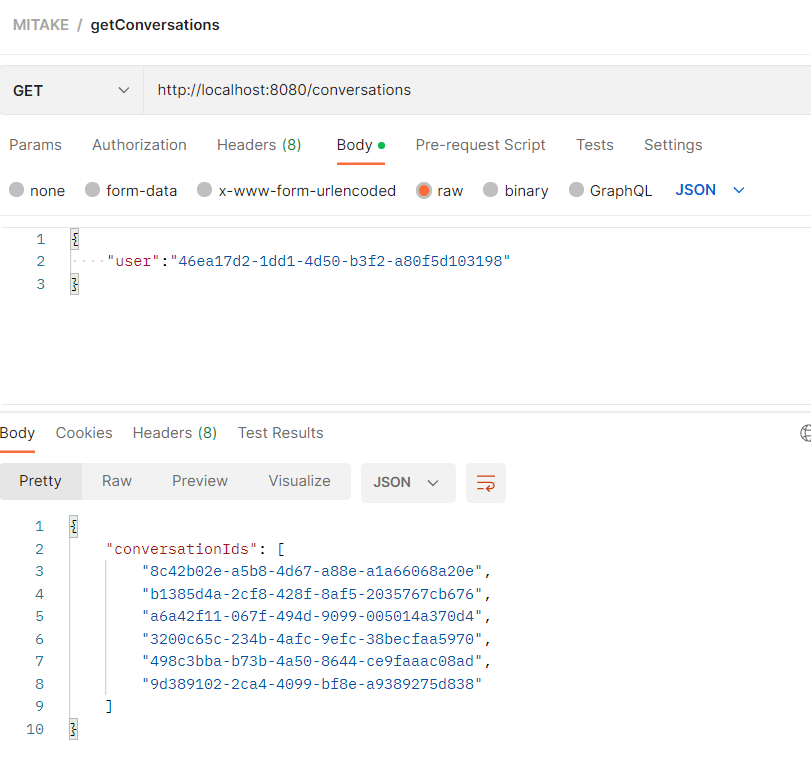
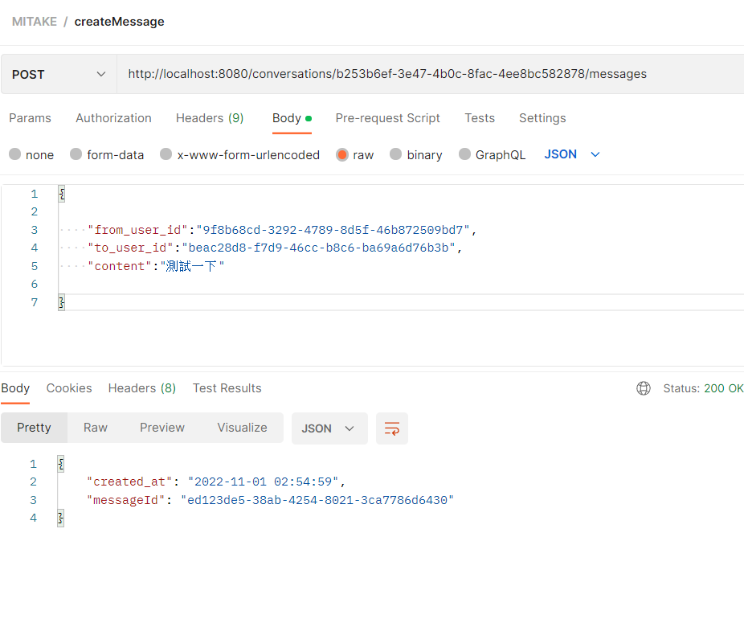
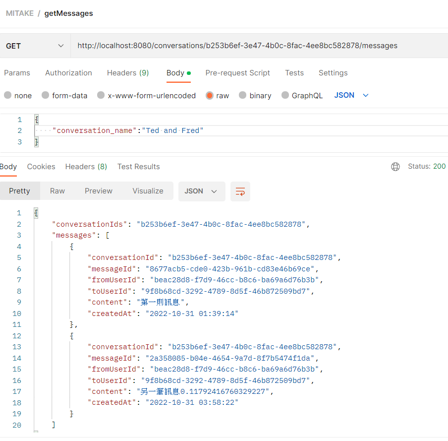

1. 需求:
   1. Client 可透過 REST API 發送訊息
   2. Client 可透過 REST API 取得訊息
   3. UserA 發送訊息後，UserB 可以在 2 秒內取得訊息並顯示 (顯示方式不限)
2. 類別分析:
   1. conversation 對話，用於儲存訊息與涉及的使用者
   2. message 訊息，聊天的內容，目前僅定義為文字，可能還會有其他類型
   3. user 使用者，目前定義為顯示userId

3. 設計流程:
   1. 使用者開啟瀏覽器後，根據userId(目前Default)執行 get conversations獲得該使用者的對話id列表
   2. 若先前無創立對話，可透過輸入another user + create(post) conversations 創立新對話，獲得該對話id
   3. 點選id後進入對話，會觸發get messages，根據此對話id 讀取(get)對話紀錄，進入聊天視窗
   4. 使用者於訊息輸入框，輸入訊息後，按發送，觸發 create/send(post) message，觸發後端websocket SendTo轉傳事件到前端

4. restful api design
   1. 【createConversation】 
      1. METHOD:Post
      2. Path: {host_prefix}/conversations
      3. Content type : Json
      4. Args: no
      5. Postman example:
   2. 【getConversations】
      1. METHOD:Get
      2. Path: {host_prefix}/conversations
      3. Content type : Json
      4. Args: 
         1. @RequestBody String userInfo
      5. Postman example:
   3. 【createMessage】
      1. METHOD:Post
      2. Path: {host_prefix}/conversations/{conversationsId}/messages
      3. Content type : Json
      4. Args: 
         1. @QueryParam("conversationsId") String
         2. @RequestBody String conversationInfo
      5. Postman example:
   4. 【getMessages】
      1. METHOD:Get
      2. Path: {host_prefix}/conversations/{conversationsId}/messages
      3. Content type : Json
      4. Args:
         1. @QueryParam("conversationsId") String
         2. @RequestBody String conversationInfo
      5. Postman example: